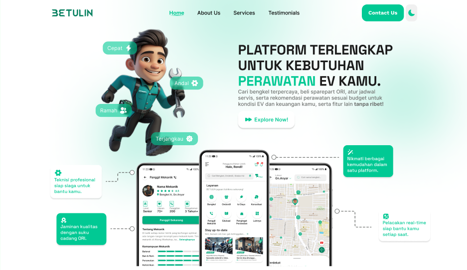
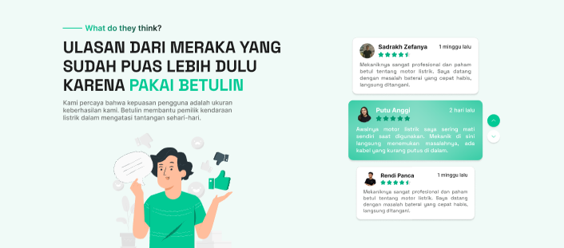

> # Team Genesis 😈

# Contribution Guide

### Alur Persiapan

1. `git clone https://github.com/adeprastya/<nama-repo>.git`
2. `cd <nama-repo>`
3. `git remote -v` Pastikan remote sesuai dengan repo github
4. `npm i`
5. `npm run dev` Pastikan server sukses berjalan

### Alur Kerja Kontribusi

1. Pastikan berada di branch main `git branch` contoh output `main *` (branch aktif terdapat ` *`)
2. Sinkronisasi perubahan di main `git pull origin main`
3. Buat branch baru `git switch -c <nama-branch>` contoh: `git switch -c section-1`
4. Pastikan berada di branch baru `git branch` contoh output `section-1 *` (branch aktif terdapat ` *`)
5. Lakukan perubahan pada kode
6. Commit & push

- `git add .`
- `git commit -m "<pesan commit>"` contoh: `git commit -m "add first section"`
- `git push origin <nama-branch>`
- `git log -5 --oneline --graph` (Optional) untuk verifikasi push

7. Tunggu di review & merge oleh koordinator
8. Ulangi proses ini untuk setiap perubahan baru yang ingin dikembangkan

# Current Task Division

- ADE - `Section 1`
  
- BIMA - `Section 2`, `Section 4`
  
  
- RAKA - `Section 3`
  
- RENA - `Section 4`, `Section 5`
  
  

# Current Next.js Set Up

- What is your project named? ... `betulin`
- Would you like to use TypeScript? ... `No`
- Would you like to use ESLint? ... `Yes`
- Would you like to use Tailwind CSS? ... `Yes`
- Would you like your code inside a `src/` directory? ... `Yes`
- Would you like to use App Router? (recommended) ... `No`
- Would you like to use Turbopack for `next dev`? ... `Yes`
- Would you like to customize the import alias (`@/*` by default)? ... `Yes`
- What import alias would you like configured? ... `@/\*`

# Tech Used Plan

- Node ^22
- Next.js (Pages router)
- Tailwind v4

---

---

> # Thank You! ✌️
